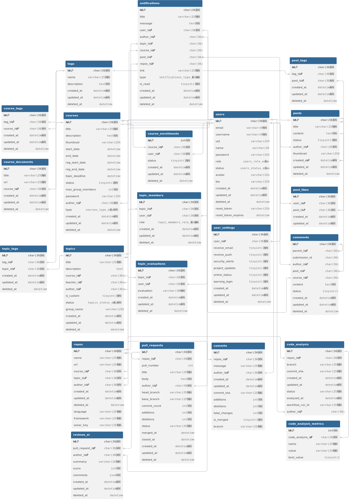

# 📌 CodeFlow - Hệ Thống Quản Lý Dự Án Phần Mềm Tích Hợp GitHub

## 🔗 Yêu cầu đề tài

Hệ thống toàn diện để quản lý dự án phần mềm sinh viên, tích hợp GitHub để theo dõi tiến độ, đánh giá chất lượng mã nguồn tự động, và cung cấp dashboard phân tích đóng góp chi tiết của từng thành viên nhóm.

## 📖 Giới thiệu

**CodeFlow** là nền tảng quản lý dự án phần mềm hiện đại được thiết kế dành riêng cho môi trường giáo dục. Hệ thống tích hợp sâu với GitHub để cung cấp trải nghiệm quản lý dự án liền mạch, từ việc tạo môn học, phân công đề tài đến theo dõi tiến độ và đánh giá chất lượng mã nguồn tự động.

---

## 🎯 Mục tiêu dự án

- Quản lý đề tài, nhóm sinh viên và tiến độ dự án phần mềm.
- Tự động lấy thông tin commit, pull request từ GitHub qua webhook.
- Tự động kiểm tra chất lượng mã nguồn qua GitHub Actions.
- Thống kê số lần nộp bài, đóng góp từng thành viên.
- Hiển thị dữ liệu trên dashboard cho giảng viên và sinh viên theo dõi.

---

## 🛠️ Công nghệ sử dụng

### Backend
- **Runtime**: Node.js với TypeScript
- **Framework**: Express.js
- **Database**: MySQL với Sequelize ORM
- **Authentication**: GitHub OAuth 2.0
- **API**: RESTful API với Swagger documentation
- **Real-time**: GitHub Webhooks

### Frontend
- **Framework**: Next.js 14 với TypeScript
- **Styling**: Tailwind CSS + Shadcn/ui
- **State Management**: React Query (TanStack Query)
- **Internationalization**: next-intl (Tiếng Việt, English, Japanese)
- **Charts**: Recharts, Chart.js
- **Rich Text Editor**: TipTap

### GitHub Integration & AI
- **GitHub API**: Repositories, Commits, Pull Requests
- **GitHub Actions**: Automated CI/CD workflows
- **GitHub Webhooks**: Real-time event processing
- **🤖 Google Gemini AI**: Advanced AI code review và analysis
- **Code Analysis**: SonarCloud + Gemini AI dual analysis
- **Intelligent Code Review**: AI-powered suggestions và feedback

### DevOps & Deployment
- **Containerization**: Docker
- **Deployment**: Railway / Vercel / Render
- **Environment**: Docker Compose for development 

---

## 📌 Các chức năng chính

### 🔐 Hệ thống Xác thực & Phân quyền
- **GitHub OAuth**: Đăng nhập bằng tài khoản GitHub
- **Multi-role system**: Admin, Teacher, Student
- **Permission management**: Phân quyền chi tiết theo vai trò
- **Session management**: Quản lý phiên đăng nhập an toàn

### 👩‍🏫 Dashboard Giảng viên
- **Course Management**: Tạo, chỉnh sửa, quản lý môn học
- **Topic Management**: Tạo đề tài, phân công nhóm
- **Student Oversight**: Theo dõi sinh viên, quản lý thành viên
- **Progress Tracking**: Giám sát tiến độ dự án real-time
- **Analytics Dashboard**: Thống kê đóng góp, hiệu suất nhóm
- **Code Quality Reports**: Báo cáo chất lượng mã tự động
- **Evaluation System**: Hệ thống đánh giá dự án

### 👨‍🎓 Portal Sinh viên
- **Course Registration**: Đăng ký môn học, xem thông tin khóa học
- **Topic Selection**: Chọn đề tài có sẵn hoặc đề xuất đề tài mới
- **Team Formation**: Tạo nhóm, mời thành viên, quản lý team
- **Repository Integration**: Kết nối GitHub repository với dự án
- **Progress Dashboard**: Theo dõi tiến độ cá nhân và nhóm
- **Contribution Analytics**: Xem thống kê đóng góp chi tiết
- **Code Quality Metrics**: Theo dõi chất lượng mã của nhóm

### 🏢 Quản trị Hệ thống (Admin)
- **User Management**: Quản lý người dùng toàn hệ thống
- **System Settings**: Cấu hình hệ thống, parameters
- **Content Moderation**: Kiểm duyệt bài viết, comments
- **Analytics Overview**: Tổng quan thống kê toàn hệ thống
- **Tag Management**: Quản lý tags, categories
- **Notification System**: Hệ thống thông báo tập trung

### 📊 GitHub Integration & Analytics
- **Repository Tracking**: Theo dõi repositories tự động
- **Commit Analysis**: Phân tích commits, tracking contributions
- **Pull Request Management**: Quản lý PR với AI-powered review
- **🤖 Gemini AI Code Review**: Tự động review PR bằng Google Gemini AI
- **Code Quality Assessment**: Đánh giá chất lượng mã tự động với scoring
- **Intelligent Comments**: AI comment trực tiếp trên GitHub PR
- **Contributor Statistics**: Thống kê đóng góp từng thành viên
- **Activity Timeline**: Timeline hoạt động development
- **Workflow Automation**: Tự động hóa quy trình với GitHub Actions

### 💬 Social & Communication Features
- **Discussion Posts**: Hệ thống bài viết, thảo luận
- **Comment System**: Bình luận đa cấp với mentions
- **Notification Center**: Trung tâm thông báo real-time
- **User Profiles**: Hồ sơ người dùng với GitHub integration
- **Activity Feed**: Luồng hoạt động cập nhật

### 🔍 Search & Discovery
- **Advanced Search**: Tìm kiếm nâng cao courses, topics, posts
- **Tag-based Filtering**: Lọc content theo tags
- **User Search**: Tìm kiếm người dùng, members
- **Content Discovery**: Khám phá nội dung liên quan

### ⚙️ System Features
- **Multi-language Support**: Hỗ trợ đa ngôn ngữ (VI, EN, JP)
- **Responsive Design**: Giao diện responsive mọi thiết bị
- **Dark/Light Mode**: Chế độ sáng/tối
- **File Management**: Upload, quản lý files
- **Data Export**: Xuất báo cáo, thống kê
- **Backup & Recovery**: Sao lưu và khôi phục dữ liệu

---

## ⚙️ Kiến trúc Hệ thống

### 🏗️ Architecture Overview
```
┌─────────────────┐    ┌─────────────────┐    ┌─────────────────┐
│   Next.js UI    │────│  Express API    │────│   MySQL DB      │
│   (Frontend)    │    │   (Backend)     │    │   (Database)    │
└─────────────────┘    └─────────────────┘    └─────────────────┘
         │                       │                       │
         │              ┌─────────────────┐              │
         └──────────────│  GitHub API     │──────────────┘
                        │  & Webhooks     │
                        └─────────────────┘
```

### 📂 Database Schema
- **Users**: Thông tin người dùng, GitHub integration
- **Courses**: Môn học, metadata, settings
- **Topics**: Đề tài dự án, requirements, deadlines
- **Repositories**: GitHub repos liên kết với topics
- **Commits**: Tracking commits từ GitHub
- **CodeAnalysis**: Kết quả phân tích chất lượng mã
- **PullRequests**: Quản lý pull requests
- **Comments**: Hệ thống bình luận đa cấp
- **Posts**: Bài viết, thảo luận
- **Tags**: Tagging system cho content
- **Notifications**: Hệ thống thông báo

### 🔧 Development Workflow
1. **Environment Setup**: Docker-based development environment
2. **Code Development**: TypeScript với strict type checking
3. **Testing**: Unit tests, integration tests
4. **Code Quality**: ESLint, Prettier, SonarCloud
5. **CI/CD**: GitHub Actions cho automated testing
6. **Deployment**: Containerized deployment


> ### 🤖 ** AI Code Review với Google Gemini**
> 
> **CodeFlow** tích hợp **Google Gemini 1.5 Flash AI** để review code tự động! 
> 
> - ✨ **AI review Pull Request** bằng tiếng Việt
> - 🎯 **Chấm điểm 0-10** cho chất lượng code  
> - 💬 **Comment trực tiếp** trên GitHub PR
> - 🔍 **Phân tích đa chiều**: Bug, Security, Performance, Readability
> - 🚀 **One-click review** - Click và AI sẽ analyze toàn bộ PR


---

## 📅 Kế hoạch thực hiện

| Tuần        | Công việc chính                                                             |
| :---------- | :-------------------------------------------------------------------------- |
| 07/04-13/04 | Xác định đề tài, viết đề cương, phân tích yêu cầu, nghiên cứu công nghệ     |
| 14/04-20/04 | Nghiên cứu GitHub API, OAuth, Webhook, Actions, setup môi trường phát triển |
| 21/04-27/04 | Thiết kế CSDL, vẽ sơ đồ hệ thống, thiết kế cấu trúc thư mục                 |
| 28/04-04/05 | Xây dựng API người dùng, môn học, đề tài. OAuth GitHub                      |
| 05/05-11/05 | Xây dựng chức năng đăng ký đề tài, tạo nhóm, phân quyền nhóm                |
| 12/05-18/05 | Thiết lập webhook, xử lý dữ liệu commit, lưu vào CSDL                       |
| 19/05-25/05 | Cấu hình GitHub Actions, workflow kiểm tra mã, ghi nhận kết quả             |
| 26/05-01/06 | Xây dựng frontend quản lý môn học, đề tài, nhóm                             |
| 02/06-08/06 | Hoàn thiện dashboard thống kê đóng góp, kết nối frontend-backend            |
| 09/06-15/06 | Hoàn thiện tính năng, kiểm thử toàn bộ, triển khai hệ thống demo            |
| 16/06       | Tổng kết kết quả, viết báo cáo, chuẩn bị thuyết trình                       |

---

## 📚 Tài liệu tham khảo

[1] Node.js Foundation, “Node.js Documentation,” [Online]. Available: https://nodejs.org/en/docs/.

[2] Express.js, “Express - Node.js web application framework,” [Online]. Available: https://expressjs.com/.

[3] Sequelize, “Sequelize ORM Documentation,” [Online]. Available: https://sequelize.org/docs/v6/.

[4] Vercel Inc, “Next.js Documentation,” [Online]. Available: https://nextjs.org/docs.

[5] GitHub, “GitHub API Documentation,” [Online]. Available: https://docs.github.com/en/rest.

[6] GitHub, “GitHub Webhooks Documentation,” [Online]. Available: https://docs.github.com/en/webhooks.

[7] GitHub, “GitHub Actions Documentation,” [Online]. Available: https://docs.github.com/en/actions.

---


# 🧭 Quy trình hoạt động của hệ thống

## 1. Tạo và quản lý môn học
- Giảng viên đăng nhập hệ thống
- Tạo môn học và thêm các đề tài (có thể gợi ý hoặc để sinh viên đề xuất)

## 2. Đăng ký đề tài và tạo nhóm
- Sinh viên đăng nhập bằng tài khoản GitHub (qua OAuth hoặc Firebase)
- Sinh viên chọn đề tài giảng viên tạo hoặc đề xuất đề tài mới
- Sinh viên mời bạn cùng nhóm, hệ thống ghi nhận thành viên nhóm

## 3. Kết nối với GitHub
- Nhóm sinh viên kết nối repo GitHub dự án của mình với hệ thống
- Hệ thống yêu cầu quyền truy cập repo và tạo webhook

## 4. Nộp bài và theo dõi tự động
- Khi sinh viên push code hoặc tạo pull request, GitHub gửi webhook về hệ thống
- Hệ thống ghi nhận thời gian nộp bài, commit, người thực hiện

## 5. Đánh giá tự động đa tầng

### 🤖 AI Code Review với Gemini
Hệ thống tích hợp **Google Gemini 1.5 Flash** để review code tự động:
- **Trigger thủ công**: Giảng viên/sinh viên click nút "AI Review" trên PR
- **Smart Analysis**: AI phân tích diff code và đưa ra nhận xét chi tiết
- **Vietnamese Commentary**: AI comment bằng tiếng Việt dễ hiểu
- **Scoring System**: Chấm điểm 0-10 cho chất lượng tổng thể
- **GitHub Integration**: Comment trực tiếp lên PR trên GitHub

### 🔧 GitHub Actions Workflow
GitHub Actions được kích hoạt để:
- **Unit Testing**: Kiểm thử tự động
- **Code Linting**: ESLint, Prettier formatting
- **Security Scan**: Vulnerability detection
- **SonarCloud Analysis**: Static code analysis
- **Performance Testing**: Load testing cho web apps
- **Build Verification**: Đảm bảo code compile thành công

### 📊 Dual Analysis System
Kết hợp cả **AI Review** và **Static Analysis**:
- **Gemini AI**: Đánh giá logic, best practices, security patterns
- **SonarCloud**: Technical debt, code smells, complexity metrics
- **Combined Scoring**: Điểm tổng hợp từ nhiều nguồn
- **Detailed Reports**: Báo cáo chi tiết cho giảng viên và sinh viên
### C1: Xinh quyền OAuth + Repository access
- Khi sinh viên đăng nhập bằng GitHub, yêu cầu quyền:

`repo, workflow, read:org, admin:repo_hook`

👉 Phải khai báo trong OAuth App (hoặc Firebase Auth + Custom OAuth Scopes).

### C2: Yêu cầu Sinh viên cài webhook thủ công
- Bạn cung cấp 1 file .github/workflows/evaluate.yml với sẵn các bước đánh giá code.

- Sinh viên thêm file đó vào repo của nhóm.

- Khi họ push code, GitHub Action tự chạy đánh giá và gửi kết quả về server qua webhook.

## 6. Analytics & Reporting Engine
Hệ thống cung cấp analytics toàn diện với:

### 📈 Student Analytics
- **Contribution Metrics**: Lines of code, commits, PRs
- **Activity Patterns**: Thời gian làm việc, frequency
- **Code Quality Trends**: Improvement over time
- **Collaboration Index**: Interaction với team members

### 👥 Team Analytics  
- **Team Performance**: Collective metrics, velocity
- **Member Comparison**: Relative contributions
- **Collaboration Network**: Team interaction patterns
- **Progress Tracking**: Milestone completion rates

### 🏫 Course Analytics
- **Class Performance**: Overall course statistics
- **Topic Difficulty**: Success rates per topic
- **Engagement Metrics**: Student participation levels
- **Resource Utilization**: Popular topics, tools

### 📊 Real-time Dashboards
- **Live Activity Feeds**: Real-time commit streams
- **Interactive Charts**: Recharts-based visualizations
- **Filterable Reports**: Time range, member, topic filters
- **Export Capabilities**: PDF, CSV, JSON formats

## 7. Automated Assessment System
Hệ thống đánh giá tự động đa chiều:

### 🤖 Code Quality Assessment
- **Static Analysis**: SonarCloud integration
- **Code Coverage**: Test coverage tracking  
- **Security Scan**: Vulnerability detection
- **Performance Metrics**: Code efficiency analysis

### 📝 AI-Powered Code Review với Gemini
- **🤖 Gemini 1.5 Flash Integration**: Sử dụng Google Gemini AI cho code review
- **Automated Pull Request Review**: Tự động phân tích và comment trên GitHub PR
- **Smart Code Analysis**: Đánh giá logic, performance, security, maintainability
- **Vietnamese Language Support**: AI review và comment bằng tiếng Việt
- **Scoring System**: Chấm điểm PR từ 0-10 dựa trên chất lượng code
- **Line-specific Comments**: Comment chi tiết trên từng dòng code có vấn đề
- **Multi-criteria Evaluation**: 
  - 🐛 **Bug Detection**: Phát hiện lỗi logic và potential bugs
  - 🔒 **Security Analysis**: Kiểm tra lỗ hổng bảo mật
  - ⚡ **Performance Review**: Gợi ý cải thiện hiệu suất
  - 📖 **Code Readability**: Đánh giá độ dễ đọc và maintainability
  - 🔧 **Best Practices**: Kiểm tra coding standards và conventions

### 🏆 Grading & Evaluation
- **Multi-criteria Scoring**: Code quality + contribution + collaboration
- **Weighted Assessment**: Customizable evaluation criteria
- **Progress-based Grading**: Continuous assessment model
- **Peer Review Integration**: Student peer evaluation system


---

## 🚀 Quick Start

### Prerequisites
- Node.js 18+ và npm/yarn
- MySQL 8.0+
- Docker & Docker Compose (optional)
- GitHub OAuth App credentials

### Installation

```bash
# Clone repository
git clone https://github.com/your-org/codeflow.git
cd codeflow

# Setup backend
cd src/server
npm install
cp .env.example .env
# Configure database và GitHub OAuth trong .env

# Setup frontend  
cd ../client
npm install
cp .env.example .env.local
# Configure API endpoints

# Run with Docker Compose
docker-compose up -d

# Or run manually
cd src/server && npm run dev
cd src/client && npm run dev
```

### GitHub Integration Setup
1. **GitHub OAuth App**:
   - Tạo tại https://github.com/settings/applications/new
   - Callback URL: `http://localhost:3000/api/auth/github/callback`
   - Copy Client ID và Client Secret vào `.env`

2. **Gemini AI Configuration**:
   ```bash
   # Lấy Gemini API key từ Google AI Studio
   GEMINI_TOKEN=your_gemini_api_key_here
   ```

3. **GitHub Webhooks**: 
   - Cấu hình webhook cho repositories cần tracking
   - Events: `push`, `pull_request`, `pull_request_review`

4. **Repository Permissions**:
   - Đảm bảo GitHub App có quyền:
   - `repo`, `pull_requests:write`, `contents:read`

---

## 🤖 Hướng dẫn sử dụng AI Review với Gemini

### 🔧 Cấu hình ban đầu

1. **Admin Configuration**:
   - Đăng nhập với tài khoản Admin
   - Vào `Settings > AI Configuration`
   - Nhập **Gemini API Key** (lấy từ [Google AI Studio](https://aistudio.google.com/))
   - Test connection để đảm bảo API hoạt động

2. **Repository Setup**:
   - Đảm bảo repository đã được kết nối với hệ thống
   - GitHub App cần có quyền `pull_requests:write` để comment

### 📝 Quy trình Review

1. **Tạo Pull Request**:
   ```bash
   # Sinh viên tạo branch và push code
   git checkout -b feature/new-feature
   git add .
   git commit -m "Add new feature"
   git push origin feature/new-feature
   
   # Tạo PR trên GitHub
   ```

2. **Trigger AI Review**:
   - Vào trang `Repository > Pull Requests` trong hệ thống
   - Click nút **"🤖 AI Review"** trên PR muốn review
   - Hệ thống sẽ gửi code diff tới Gemini AI

3. **Kết quả Review**:
   - **GitHub Comments**: AI sẽ comment trực tiếp trên PR
   - **Score Display**: Điểm 0-10 hiển thị trên UI
   - **Summary**: Tóm tắt đánh giá tổng quan

### 🎯 Tiêu chí Đánh giá

AI sẽ phân tích code theo 5 tiêu chí chính:

| Tiêu chí | Mô tả | Ví dụ |
|----------|--------|-------|
| 🐛 **Bug Detection** | Phát hiện lỗi logic | Null pointer, off-by-one errors |
| 🔒 **Security** | Kiểm tra bảo mật | SQL injection, XSS vulnerabilities |
| ⚡ **Performance** | Tối ưu hiệu suất | Inefficient loops, memory leaks |
| 📖 **Readability** | Độ dễ đọc | Variable naming, code structure |
| 🔧 **Best Practices** | Coding standards | Design patterns, conventions |

### 📊 Scoring System

- **9-10**: Excellent - Code chất lượng cao, ít hoặc không có vấn đề
- **7-8**: Good - Code tốt với một vài cải thiện nhỏ
- **5-6**: Average - Code ổn nhưng cần cải thiện đáng kể
- **3-4**: Below Average - Nhiều vấn đề cần sửa
- **0-2**: Poor - Code có nhiều lỗi nghiêm trọng

### 💡 Tips cho Sinh viên

1. **Trước khi tạo PR**:
   - Self-review code trước khi push
   - Viết commit message rõ ràng
   - Thêm mô tả chi tiết cho PR

2. **Sau khi nhận AI Review**:
   - Đọc kỹ từng comment của AI
   - Implement suggestions quan trọng
   - Push updates và request review lại nếu cần

3. **Best Practices**:
   - Tạo PR nhỏ, focused (dưới 500 lines)
   - Viết code comments cho logic phức tạp
   - Follow team coding standards

### ⚠️ Lưu ý quan trọng

- **Token Limits**: Gemini có giới hạn token, PR quá lớn có thể bị reject
- **Language**: AI review chủ yếu bằng tiếng Việt
- **Manual Review**: AI không thay thế hoàn toàn human review
- **Cost Management**: Admin cần monitor API usage

---

## 📱 Screenshots & Demo


### Dashboard Overview


## 🤝 Contributing

Chúng tôi hoan nghênh mọi đóng góp! Vui lòng đọc [CONTRIBUTING.md](CONTRIBUTING.md) để biết thêm chi tiết.

### Development Guidelines
1. Fork repository và tạo feature branch
2. Commit với conventional commits format
3. Viết tests cho features mới
4. Đảm bảo pass tất cả tests và linting
5. Tạo Pull Request với mô tả chi tiết

---

## 🐛 Bug Reports & Feature Requests

- 🐛 **Bug Reports**: Sử dụng [GitHub Issues](https://github.com/your-org/codeflow/issues)
- 💡 **Feature Requests**: Tạo [Feature Request](https://github.com/your-org/codeflow/issues/new?template=feature_request.md)
- 📧 **Support**: Email hỗ trợ tại support@codeflow.edu.vn

---

## 📈 Roadmap

### Phase 1 (Completed)
- [x] Basic course & topic management
- [x] GitHub OAuth integration
- [x] Repository tracking
- [x] Basic analytics dashboard

### Phase 2 (In Progress)  
- [x] **Gemini AI Code Review**: ✅ Đã hoàn thành
- [ ] Advanced AI features (GPT-4, Claude integration)
- [ ] Mobile app development
- [ ] Integration với LMS platforms (Moodle, Canvas)
- [ ] Advanced reporting features

### Phase 3 (Planned)
- [ ] Multi-university support
- [ ] Blockchain-based certification
- [ ] Advanced ML analytics
- [ ] API marketplace for plugins

## 📌 License

© 2025 by Đinh Tấn Mãi. Dự án phục vụ mục đích học tập và nghiên cứu.
