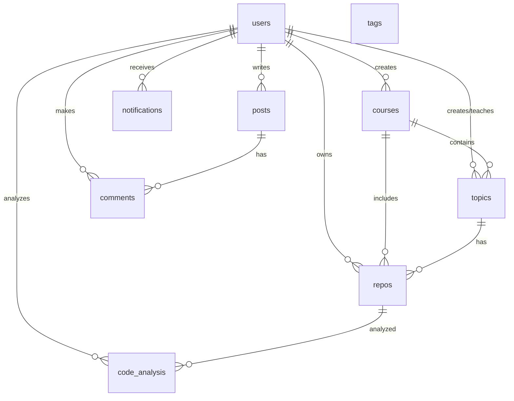

# Database Schema - CodeFlow

## Tổng quan
Database CodeFlow được thiết kế để hỗ trợ hệ thống quản lý khóa học, dự án và phân tích code. Hệ thống bao gồm các module chính:
- **Quản lý người dùng và xác thực**
- **Quản lý khóa học và chủ đề**
- **Quản lý repository và code analysis**
- **Hệ thống bài viết và bình luận**
- **Hệ thống thông báo**
- **Quản lý tags và phân loại**

## Sơ đồ ERD



## Bảng chính

### 1. **users** - Quản lý người dùng
- **Chức năng**: Lưu trữ thông tin người dùng, xác thực và phân quyền
- **Roles**: admin, user, teacher
- **Status**: active, inactive, suspended
- **Đặc điểm**: Hỗ trợ reset password, soft delete

### 2. **courses** - Quản lý khóa học
- **Chức năng**: Quản lý thông tin khóa học, thời gian đăng ký, deadline
- **Types**: major, foundation, elective, thesis
- **Đặc điểm**: Có thể protected bằng password, giới hạn thành viên nhóm

### 3. **topics** - Quản lý chủ đề/đề tài
- **Chức năng**: Chứa các đề tài của khóa học
- **Status**: pending, approved, rejected
- **Đặc điểm**: Có thể custom topic, gán teacher phụ trách

### 4. **repos** - Quản lý repository
- **Chức năng**: Liên kết với GitHub repos, lưu thông tin technical stack
- **Metadata**: language, framework, sonar_key cho code analysis
- **Relationships**: Thuộc về course và topic cụ thể

### 5. **posts** - Hệ thống bài viết
- **Chức năng**: Blog posts, discussions, announcements
- **Features**: Rich text content, thumbnail, status management
- **Interactions**: Comments, likes, tags

### 6. **comments** - Hệ thống bình luận
- **Chức năng**: Bình luận đa cấp (nested comments)
- **Contexts**: Posts, submissions, courses
- **Features**: Reply to comments, soft delete

## Bảng phụ trợ

### Quản lý thành viên và enrollment
- **course_enrollments**: Đăng ký khóa học
- **topic_members**: Thành viên nhóm đề tài (leader/member roles)

### Code Analysis & Reviews
- **code_analysis**: Kết quả phân tích code từ CI/CD
- **code_analysis_metrics**: Chi tiết metrics (coverage, quality gates...)
- **pull_requests**: Thông tin PR từ GitHub
- **commits**: Lịch sử commit và statistics
- **reviews_ai**: AI-powered code reviews với scoring

### Evaluation & Submissions
- **submissions**: Nộp bài và đánh giá
- **topic_evaluations**: Đánh giá đề tài từ giảng viên

### Notification System
- **notifications**: Hệ thống thông báo real-time
- **Types**: TOPIC_EVALUATION, COMMENT, LIKE_POST, JOIN_COURSE, etc.

### Tagging System
- **tags**: Master tag list
- **post_tags**, **course_tags**, **topic_tags**: Many-to-many relationships

### System Management
- **user_settings**: Cài đặt cá nhân (notifications, privacy)
- **system_settings**: Cấu hình toàn hệ thống
- **course_documents**: Tài liệu khóa học

## Đặc điểm kỹ thuật

### 1. **UUID Primary Keys**
- Tất cả bảng chính sử dụng CHAR(36) UUID
- Bảo mật cao, không expose internal IDs

### 2. **Soft Delete Pattern**
- Hầu hết bảng có `deleted_at` timestamp
- Dữ liệu không bị xóa vĩnh viễn

### 3. **Audit Trail**
- `created_at`, `updated_at` trên tất cả bảng
- Theo dõi lịch sử thay đổi

### 4. **Foreign Key Constraints**
- Cascade delete cho data integrity
- SET NULL cho các reference có thể optional

### 5. **Indexing Strategy**
- Primary keys, foreign keys được index
- Unique constraints cho business logic

### 6. **JSON Support**
- `reviews_ai.comments` sử dụng JSON cho flexible data
- Hỗ trợ complex data structures

## Luồng dữ liệu chính

### 1. **Course Management Flow**
```
User (teacher) → Course → Topics → Repos → Code Analysis
```

### 2. **Student Workflow**
```
User → Course Enrollment → Topic Registration → Repo Creation → Submissions
```

### 3. **Code Quality Flow**
```
Repo → Commits → Pull Requests → Code Analysis → AI Reviews
```

### 4. **Communication Flow**
```
Posts → Comments → Notifications → User Settings → Email/Push
```

## Tối ưu hóa và mở rộng

### 1. **Performance Considerations**
- Partition lớn tables theo timeline
- Index optimization cho search queries
- Caching layer cho frequently accessed data

### 2. **Scalability Features**
- Microservices-ready schema design
- Event-driven architecture support
- API-first data access patterns

### 3. **Security Implementation**
- Role-based access control (RBAC)
- Data encryption at rest
- Audit logging cho sensitive operations

